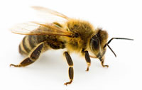

# Curriculum Vitae

## Introduction
Dedicated web developer with an eye out for The Next Big Thing™ capable and
eager to work on projects small and large where the vision is greater than
the sum of its parts. An independent worker with a fluid mind ensures
out-of-the-box thinking and a unique approach to problems and solutions.

## But who am I?
Well, My [Facebook profile](https://www.facebook.com/varlfu) is completely public, so is my [Github profile](https://github.com/varl), and sometimes I [tweet stuff](https://twitter.com/varlx). I like weightlifting, programming, meditation, and motorcycles. I'm not a big fan of skiing, though it taught me valuable life lessons about priorities through injury. I like to write, which I do privately at [my blog](http://www.vlv.io) and I have been known to rant about topics that disturb me at [Iterate's blog](https://blog.iterate.no/author/vikvar/).

I run a company registered in Sweden called [vardevs](http://www.vardevs.se). I don't do much with it except host sites, buy domains, administer servers and the occasional development and operations for friends and family. It's an ongoing learning experiment about how a company works and has taught me about taxes, VAT, inter-country invoices, book keeping and publishing yearly reports.

All-in-all _curious_ is a word I would not mind being applied to my personality. Currently I explore **Clojure**, **Go**, and **Elm**.

## What's happened recently?
- Frontend Architect:
  - _2017&ndash;_, [DHIS2](https://github.com/varl/cv/blob/master/PROJECTS.md#dhis2): front-end architect, team lead
- Consulting, last 3 customers:
  - _2015&ndash;2016_ [Amedia](https://github.com/varl/cv/blob/master/PROJECTS.md#amedia): back-end, front-end, team lead, devops
  - _2016&ndash;2017_ [Cisco](https://github.com/varl/cv/blob/master/PROJECTS.md#cisco-systems): front-end, devops, tech lead
  - _2017&ndash;2017_ [PorterBuddy](https://github.com/varl/cv/blob/master/PROJECTS.md#porterbuddy): devops, cloud architect

- Professional development
  - Mentor for developers
  - Board member
  - Recruitment

## What'll happen next?
It is of increasing import to have meaning in my work, and to support this goal, first
the word 'meaning' needs to be unpacked. This far I have these principles to guide me towards meaningful work:

- Create value
- Reduce waste

## Favorite books
- [_Pragmatic Programmer_](https://en.wikipedia.org/wiki/The_Pragmatic_Programmer)
- [_Zen and the Art of Motorcycle Maintenance_](https://en.wikipedia.org/wiki/Zen_and_the_Art_of_Motorcycle_Maintenance)
- [_Flatland_](https://en.wikipedia.org/wiki/Flatland)
- [_Steppenwolf_](https://en.wikipedia.org/wiki/Steppenwolf_(novel))

## Work Experience
#### 2017&ndash;*present*, Frontend Architect, [DHIS2](https://www.dhis2.org), Oslo (Norway)

Responsibilities include:
  - Team Leader
  - Architect for how we build frontend applications

#### 2013&ndash;2017, Solutions Engineer, [Iterate](http://iterate.no), Oslo (Norway)

Projects for:
  - [Amedia](https://github.com/varl/cv/blob/master/PROJECTS.md#amedia)
  - [Cisco](https://github.com/varl/cv/blob/master/PROJECTS.md#cisco-systems)
  - [Gjensidige](https://github.com/varl/cv/blob/master/PROJECTS.md#gjensidige)
  - [Woolit](https://github.com/varl/cv/blob/master/PROJECTS.md#woolit)

#### 2010&ndash;*present*, Owner, [vardevs](http://vardevs.se), (Sweden)

Projects for:
- [HMode](https://github.com/varl/cv/blob/master/PROJECTS.md#hmode)
- [JC Älmhult](https://github.com/varl/cv/blob/master/PROJECTS.md#jc-Älmhult)
- [Verona Motor](https://github.com/varl/cv/blob/master/PROJECTS.md#verona-motor)
- [Svärdells AB](https://github.com/varl/cv/blob/master/PROJECTS.md#svärdells-ab)
- [Perigee](https://github.com/varl/cv/blob/master/PROJECTS.md#perigee)

#### 2011&ndash;2013, Software Engineer, [Accenture](http://accenture.com), Oslo (Norway)

Projects for: 
  - [NAV](https://github.com/varl/cv/blob/master/PROJECTS.md#nav)
  - [SPK](https://github.com/varl/cv/blob/master/PROJECTS.md#spk)

#### 2008&ndash;2010, Consultant, [Cybercom Group](http://cybercom.se), Karlskrona (Sweden)

Projects for:
- [Svenska Handelsbanken](https://github.com/varl/cv/blob/master/PROJECTS.md#svenska-handelsbanken)
- [Sony Ericsson Mobile Sweden](https://github.com/varl/cv/blob/master/PROJECTS.md#sony-ericsson)
- [Ericsson / FIFA](https://github.com/varl/cv/blob/master/PROJECTS.md#ericsson)

#### 2005&ndash;2008, Web-developer, [Kaxig Idébyrå](http://kaxig.com), Älmhult (Sweden)

Projects for:
- [Kaxig](https://github.com/varl/cv/blob/master/PROJECTS.md#kaxig)

## Skills
*

I focus on the bigger picture and strive to be full-stack. **NodeJS**, **Python**, **Java**, **\*sh** running on **Linux**, **Windows** and **MacOS** are the primary system level environments I rely on to do my job. **JavaScript**, **HTML** and **CSS** to create great user experiences in the client and back it using database storage such as **IndexedDB**, **SQLite** or **PostgreSQL** which I write hand-tuned **SQL** for. I deploy using **VPS** technology and set it up to hardened linux configuration and **nginx** for serving content and proxying requests to applications.

For heavy hitters I set up cloud deployment to e.g. **Akamai**, **Amazon's Cloud**, or **Google's Cloud** and use **metrics** to automatically scale load-balance the production environments. **Measurements** drive a **pro-active** development mentality.

I **test** my code using automated routines which run against every **commit** to our preferred **VCS**, the marvellous **Git**. I am **autonomous** within the **team**'s **alignment**. I take **responsibility** for our work as a whole and help out where I can.

_* click bee for exhaustive list_
